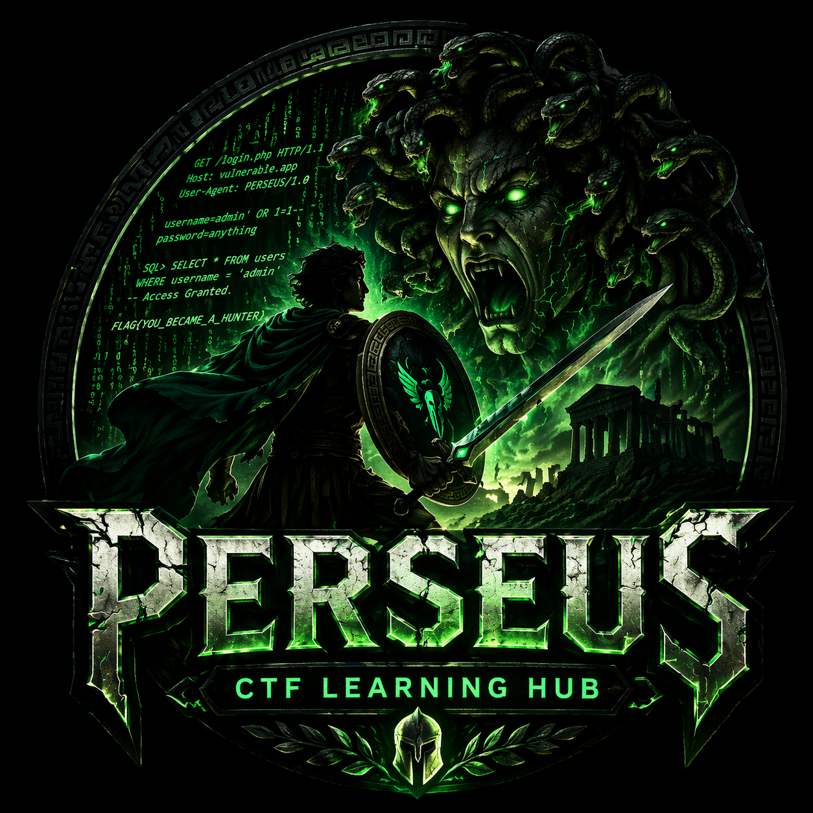

# 🛡️ PERSEUS — CTF Learning Hub

> Slay vulnerabilities. Think like a hacker.

---

<p align="center">
  
</p>

<h1 align="center">🛡️ PERSEUS — CTF Learning Hub</h1>

<p align="center">
  <b>Slay vulnerabilities. Think like a hacker.</b>
</p>

<p align="center">
  
  
  
</p>

<p align="center">
  <a href="#-start-your-journey">
    
  </a>
  <a href="codex/web.md">
    
  </a>
  <a href="arena/docker/docker-compose.yml">
    
  </a>
</p>

---

## 🧠 The Story

Inspired by Perseus — the legendary monster slayer —
this repository transforms cybersecurity learning into a hunt.

> Every vulnerability is a monster.
> Every exploit is a strategy.
> Every learner can become a hunter.

---

## ⚔️ Repository Structure

| Path        | Description                 |
| ----------- | --------------------------- |
| `journey/`  | 🗺️ Learning roadmap        |
| `monsters/` | 🐍 Vulnerability categories |
| `hunts/`    | 🧠 Real CTF writeups        |
| `arsenal/`  | 🧰 Tools & scripts          |
| `codex/`    | 📜 Cheatsheets              |
| `arena/`    | 🧪 Hands-on labs            |
| `assets/`   | 🎨 Images & branding        |

---

## 🚀 Start Your Journey

👉 **Begin here:**
📍 [`journey/beginner.md`](journey/beginner.md)

---

## 🐍 Example Monster

📍 [`monsters/web/sqli/intro.md`](monsters/web/sqli/intro.md)

Learn how SQL Injection works and how to exploit it.

---

## 🧠 Example Hunt

📍 [`hunts/picoctf/sqli-login.md`](hunts/picoctf/sqli-login.md)

Real-world CTF challenge walkthrough.

---

## 🧰 Arsenal Preview

```bash
python arsenal/scanners/sqli_scanner.py
```

---

## 🧪 Run Local Lab

```bash
cd arena/docker
docker-compose up
```

---

## 📜 Codex

📍 [`codex/web.md`](codex/web.md)

Payloads, tricks, and quick references.

---

## ⚠️ Disclaimer

This repository is for **educational purposes only**.
Use the knowledge responsibly.

---

## ⭐ Support

If this repository helps you:

* ⭐ Star this repo
* 🔁 Share with others
* 🧠 Keep learning

---

<p align="center">
  <b>⚔️ Become a Hunter ⚔️</b>
</p>

